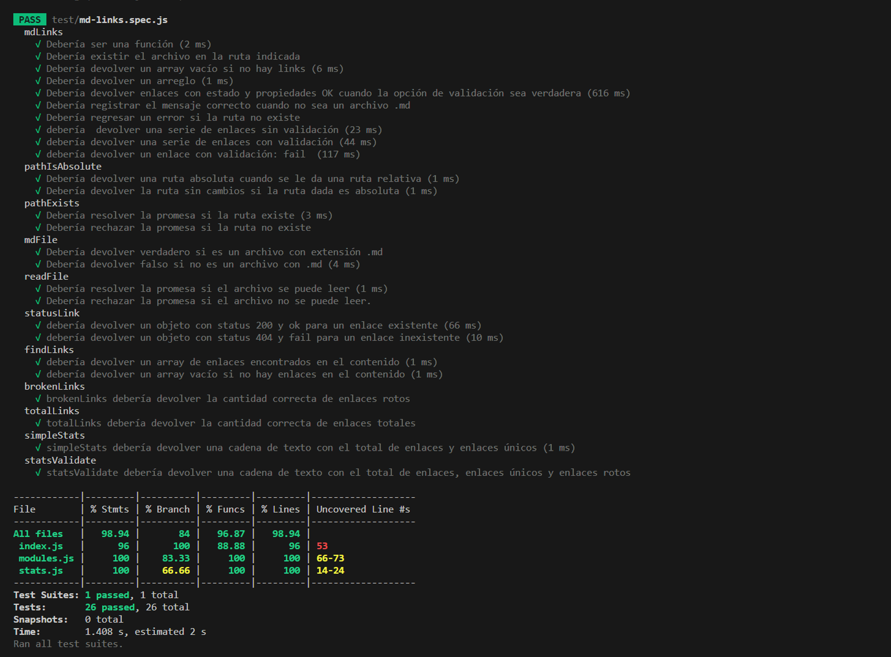
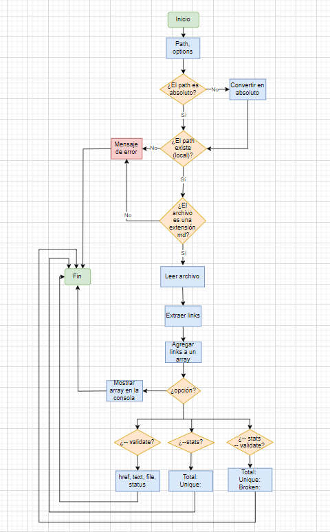

# Markdown Links

  

## Índice

* [1. ¿Qué es md-links?](#1-¿Qué-es-md-links?)
* [2. ¿Cómo instalar?](#2-¿Cómo-instalar?)
* [3. ¿Cómo usar?](#3-¿Cómo-usar?)
* [4. Resultados](#4-Resultados)
* [5. Testing](#5-Testing)
* [6. Diagrama de flujo](#5-Diagrama-de-flujo)
* [7. Autora](#5-Autora)

***

##  Índice 
-  ¿Qué es md-links?
-  ¿Cómo instalar?
-  ¿Cómo usar?
-  Resultados
-  Testing
-  Diagrama de flujo
-  Autora.

### ¿Qué es md-links?

 Es una herramienta con una librería instalable que implementa una interfaz de línea de comandos (CLI) para facilitar la validación de archivos Markdown (md) y extraer los enlaces que se encuentran en ellos, también permite verificar si los archivos .md encontrados tienen links y si estos estan funcionando correcatamente o no. 

### ¿Cómo instalar?

Para instalar la libreria sigue los siguientes pasos:

* Abre la terminal del sistema operativo de la pc.
* Navega hasta el directorio raíz del proyecto o la ubicación donde desea instalar la biblioteca.
* Ejecuta el siguiente comando en la terminal para instalar la biblioteca desde el registro del paquete npm:

npm install md-linksER

* Una vez la instalación esté completa, puede importar y usar la biblioteca en el proyecto que así lo desees de acuerdo a las instrucciones de uso a continuación.

### ¿Cómo usar?

Para obtener instrucciones sobre cómo utilizar el comando completo, ejecute 'md-links'.

md-links

Una vez instalado, debe colocar en la terminal lo siguiente:

md-links <path-to-file> [opciones]

donde:

path-to-file = es la ruta que requiere analizar (absoluta o relativa).

### Opciones

Puede utilizar las siguientes opciones adicionales para realizar validaciones u obtener estadísticas de enlaces:

Ingrese:

--validate

Esta opción permite validar los enlaces encontrados, verifica si están activos y accesibles y devuelve información sobre el estado de cada enlace.

ejemplo: 

md-links <path-to-file> --validate

Ingrese:

--stats

esta opción muestra estadísticas generales sobre los enlaces encontrados como el recuento total de enlaces.

ejemplo:

md-links <path-to-file> --stats

Ingrese:

-- validate --stats

Esta opción que surge de la combinación de las opciones anteriores permite buscar enlaces, validarlos y obtener estadísticas al mismo tiempo.

ejemplo:

md-links <path-to-file> --validate --stats

md-links <path-to-file> --stats --validate

### Resultados

Al de ejecutar el comando con las opciones correspondientes y la ruta del archivo que desee evaluar, el paquete "md-links" mostrará la información requerida en la línea de comando, incluyendo los enlaces encontrados, su estado y estadísticas generales.

### Testing

Se realizaron pruebas unitarias para la verificación del correcto funcionamiento de los siguientes archivos JS: index, modules, stats. Se obtuvo el siguiente resultado:

### Diagrama de flujo

### Autora

